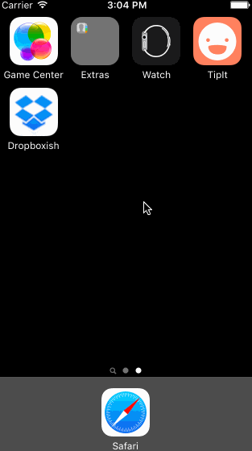

# Dropboxish
Dropbox prototype in Swift

Submitted by: Michelle Venetucci Harvey

Time spent: 8 hours spent in total

## User Stories

The following **required** functionality is complete:
* [x] User can tap through the 3 welcome screens.
* [x] User can follow the create user flow.
    * [x] On the create user form, the user can tap the back button to go to the page where they can sign in or create an account.
    * [x] Before creating the account, user can choose to read the terms of service.
    * [x] After creating the account, user can view the placeholders for Files, Photos, and Favorites as well as the Settings screen.
    * [x] User can log out from the Settings screen.
* [x] User can follow the sign in flow.
    * [x] User can tap the area for "Having trouble signing in?"
    * [x] User can log out from the Settings screen.

The following **optional** features are implemented:
* [x] Optional: Add a detail view for one of the files and implement favoriting the file. 
* [x] Optional: Add UITextFields for the forms so you can actually type in them and handle dismissing the keyboard. 
* [x] Optional: You should be able to swipe through the welcome screens instead of just tapping them.
    * [x] Create a custom free form view controller that is wide enough for 4 screens. 
    * [x] Add a UIScrollView with paging enabled.
    * [x] Add 4 UIImageViews for the welcome screens.
* [x] Add a switch statement for password length feedback
* [x] Programmatically enabled/disabled "Create" UIButton for Create account action 
* [x] Add page controls for the welcome screen swiping
* [x] Add secure text entry for the create account password field
* [x] Add an email keyboard for the email address field

## Video Walkthrough 

Here's a walkthrough of implemented user stories:

GIF created with [LiceCap](http://www.cockos.com/licecap/).

## Notes

I utilized ``sender.selected = !sender.selected`` to reverse the favoriting button action. 

I first implemented the password length feedback with a series of ``if`` statements, but refactored with a switch statement because it felt cleaner, and gave less room for mistakes in the code.

## License

    Copyright 2016 Michelle Venetucci Harvey

    Licensed under the Apache License, Version 2.0 (the "License");
    you may not use this file except in compliance with the License.
    You may obtain a copy of the License at

        http://www.apache.org/licenses/LICENSE-2.0

    Unless required by applicable law or agreed to in writing, software
    distributed under the License is distributed on an "AS IS" BASIS,
    WITHOUT WARRANTIES OR CONDITIONS OF ANY KIND, either express or implied.
    See the License for the specific language governing permissions and
    limitations under the License.

